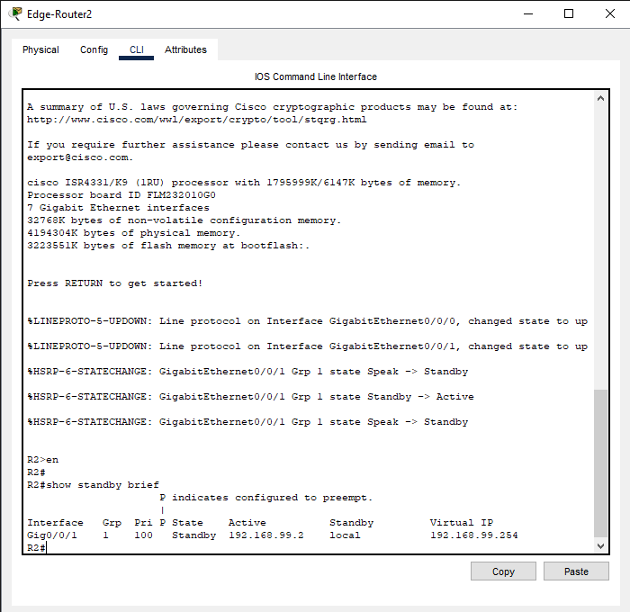
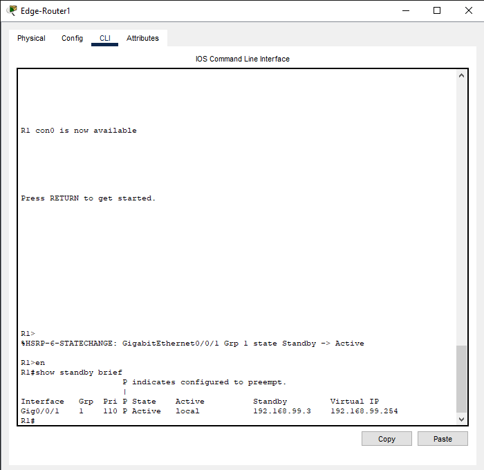

# 🧱 HSRP-Based Dual-Path Edge Redundancy and Segmented Access


---

## 📑 Table of Contents

1.  [📘 Project Overview](#-project-overview)  
2.  [🎯 Project Objective](#-project-objective)  
3.  [🌐 Network Topology](#-network-topology)  
4.  [🖧 Device Interface Table](#-device-interface-table)  
5.  [📝 IP Addressing Table](#-ip-addressing-table)  
6.  [🔧 Lab Steps](#-lab-steps)  
7.  [💻 Device Configuration](#-device-configuration)  
    - [🚦 Router 1](#-router-1)  
    - [🚦 Router 2](#-router-2) 
    - [🚦 ISP Router 1](#-isp-router-1)
    - [🚦 ISP Router 2](#-isp-router-2)
    - [🔀 Switch 1](#-switch-1)  
    - [🔀 Switch 2](#-switch-2)  
    - [🖨️ Printer Configuration](#-printer-configuration)  
    - [🖥️ PC and Laptop Configuration](#-pc-and-laptop-configuration)
8.  [✅ Verification Commands](#-verification-commands)  
9.  [⚡ How to Run Lab](#-how-to-run-lab)  
10. [📂 Folder Structure](#-folder-structure)  
11. [🧱 Lab Limitations](#-lab-limitations)  
12. [🎓 Learning Outcomes](#-learning-outcomes)  
13. [💡 Repository Info](#-repository-info)  

---

## 📘 Project Overview

This lab demonstrates a **redundant, segmented enterprise network** integrating **HSRP (Hot Standby Router Protocol)**, **Layer 3 switching**, and **NAT-enabled Internet access**.

The design ensures:
- **High availability** via dual routers using HSRP  
- **Secure VLAN segmentation**  
- **Reliable Internet access** through PAT  
- **Wireless connectivity** for multiple clients  

---

## 🎯 Project Objective

The key goals of this project:

1. Configure **Inter-VLAN routing** on SW-1 (L3 switch).  
2. Deploy **HSRP** between R1 (Active) and R2 (Standby) for gateway redundancy.  
3. Set up **PAT (Port Address Translation)** for Internet access.  
4. Segment LAN with VLANs for **Data**, **Voice**, and **Management**.  
5. Validate **wireless client connectivity** via DHCP and ping to **8.8.8.8**.  

---

## 🌐 Network Topology

📸 **Network Topology Diagram**  
`/topology/topology_overview_drawio.png`


A simplified overview of the design:

- **Edge Routers:** R1 (Active) and R2 (Standby) connected to ISPs  
- **Core Layer:** SW-1 providing Inter-VLAN routing  
- **Access Layer:** SW-2 and Wireless Routers/APs for clients  
- **Clients:** 15 wireless laptops (VLAN 10)  

---

## 🖧 Device Interface Table

| Device   | Interface | Connection | Description                       |
| :------  | :-------- | :--------- | :----------------------------     |
| **R1**   | G0/0/0    | ISP-R1     | NAT Outside                       |
| **R1**   | G0/0/1    | SW-1 F0/5  | HSRP/NAT Inside (VLAN 99)         |
| **R2**   | G0/0/0    | ISP-R2     | NAT Outside                       |
| **R2**   | G0/0/1    | SW-1 F0/6  | HSRP/NAT Inside (VLAN 99)         |
| **SW-1** | G0/1      | SW-2 G0/1  | 802.1Q Trunk                      |
| **SW-1** | VLAN 10   | SVI        | Data Gateway (192.168.10.1)       |
| **SW-1** | VLAN 99   | SVI        | Management Gateway (192.168.99.1) |

---

## 📝 IP Addressing Table

| Network / Component    | Subnet / Address  | Gateway / Purpose           |
| :-------------------   | :---------------- | :-------------------------- |
| **Data Network**       | 192.168.10.0 /24  | SW-1 VLAN 10 (192.168.10.1) |
| **Voice Network**      | 192.168.20.0 /24  | SW-1 VLAN 20 (192.168.20.1) |
| **Management Network** | 192.168.99.0 /24  | SW-1 VLAN 99 (192.168.99.1) |
| **HSRP Virtual IP**    | 192.168.99.254    | Default Gateway for LAN     |
| **R1 Public Subnet**   | 203.0.113.0 /30   | ISP-R1 Link                 |
| **R2 Public Subnet**   | 198.51.100.0 /30  | ISP-R2 Link                 |

### VLAN Summary

| VLAN ID  | Name       | Network      | Mask          | Gateway      | Purpose                       |
| :------: | :--------- | :----------- | :------------ | :----------- | :---------------------------- |
| **10**   | DATA       | 192.168.10.0 | 255.255.255.0 | 192.168.10.1 | End-user and Wireless Clients |
| **20**   | VOICE      | 192.168.20.0 | 255.255.255.0 | 192.168.20.1 | VoIP Traffic                  |
| **99**   | MANAGEMENT | 192.168.99.0 | 255.255.255.0 | 192.168.99.1 | Network Management + HSRP     |

---

## 🔧 Lab Steps

1. **VLAN & Trunk Setup**  
   Created VLANs 10, 20, 99 on both switches. Configured G0/1 as 802.1Q trunk between SW-1 and SW-2.  

2. **Inter-VLAN Routing**  
   Configured SVIs on SW-1 for VLANs 10, 20, 99 to provide gateway functionality.  

3. **DHCP Configuration**  
   DHCP pools created for VLAN 10 (Data) and VLAN 20 (Voice).  

4. **HSRP Setup**  
   Configured R1 as Active (priority 110) and R2 as Standby (priority 100).  
   Virtual IP: `192.168.99.254`.  

5. **NAT Configuration**  
   Defined **inside** (G0/0/1) and **outside** (G0/0/0) interfaces on both routers.  
   Applied PAT using an ACL for VLAN subnets.  

6. **Routing Setup**  
   Default route on SW-1 → `192.168.99.254`.  
   Static routes on ISPs for return traffic.  

7. **Wireless Integration**  
   Wireless Routers connected via VLAN 10 access ports.  
   Verified laptop DHCP and Internet access.  

---

## 💻 Device Configuration

📁 All configurations are available in the `configs/` folder.

---

### 🚦 Router 1
```text
! --- 1. External (ISP) Configuration ---
interface GigabitEthernet0/0/0
description ** Link to ISP Router 1 **
ip address 203.0.113.2 255.255.255.252
no shutdown
ip nat outside
```

[View Full Configuration File →](configs/router-config/r1.cfg)

### 🚦 Router 2
```text
! --- 1. External (ISP) Configuration ---
interface GigabitEthernet0/0/0
description ** Link to ISP Router 2 **
ip address 198.51.100.2 255.255.255.252
no shutdown
ip nat outside
```

[View Full Configuration File →](configs/router-config/r2.cfg)

### 🚦 ISP Router 1
```text
! --- Interface to R1 ---
interface GigabitEthernet0/1
ip address 203.0.113.1 255.255.255.252
no shutdown
```

[View Full Configuration File →](configs/router-config/isp-r1.cfg)


### 🚦 ISP Router 2
```text
! --- Interface to R2 ---
interface GigabitEthernet0/1
ip address 198.51.100.1 255.255.255.252
no shutdown
```

[View Full Configuration File →](configs/router-config/isp-r2.cfg)


### 🔀 Switch 1 
```text
! --- 2. Configure SVIs (Default Gateways) ---
ip routing  ! Activates Layer 3 routing

interface Vlan10
description ** Default Gateway for DATA VLAN **
ip address 192.168.10.1 255.255.255.0
no shutdown
```

[View Full Configuration File →](configs/switch-config/sw1.cfg)


### 🔀 Switch 2
```text
! --- 2. Configure Inter-Switch Trunk Link (SW2 G0/2 to SW1 G0/2) ---
! This connects SW-2 to the Core Switch SW-1
interface GigabitEthernet0/2
description ** TRUNK to SW-1 **
switchport mode trunk
switchport trunk allowed vlan 10,20,99
no shutdown
```

[View Full Configuration File →](configs/switch-config/sw2.cfg)


### 🖨️ Printer

| Device        | IP Address    | Subnet Mask   | Default Gateway |
| :----------   | :------------ | :------------ | :-------------  |
| **Printer-P1**| 192.168.20.11 | 255.255.255.0 | 192.168.20.1    |
| **Printer-P2**| 192.168.20.12 | 255.255.255.0 | 192.168.20.1    |

[View Full Configuration File →](configs/printer-config/printer.txt)

### 🖥️ PC and Laptop Configuration

- All end-user devices: DHCP enabled

- Wireless routers: VLAN 10 access ports with WPA2-PSK

- Verified Internet connectivity and HSRP failover behavior

---

## ✅ Verification Commands

** Network Topology 


**Section 1: Core Infrastructure and Redundancy**

- **VLAN and Trunking Verification** of Switch 1 (Core Switch) and Switch 2 (Access Switch)
```text
show vlan brief
show interfaces trunk
```


- **HSRP Status (Active and Standby)** on Edge Router 1 and Edge Router R2
```text
show standby brief
```




- **HSRP Failover**


- **HSRP Revert**



**Section 2: Internal DHCP and Interal-VLAN Routing**

- **DHCP Assignment** - on Laptop
```text
ipconfig /all
```


- **Inter-VLAN Routing** - Ping from a Laptop to Printer 
```text
ping 192.168.20.11
```


- **Trunking VLAN Bridge - Ping from SW1 PC to SW2 PC
```text
ping 192.168.10.12
```


- **Switch 1 Routing Check**
```text
show ip route
```


**Section 3: NAT and External Connectivity

- **NAT Translation** on Edge Router 1 (R1)
```text
ping 8.8.8.8
```
Ping 8.8.8.8 from any internal PC. Immediately run show ip nat translations on R1.


- **External Connectivity** (End-to-End) From any Laptop
```text
ping 8.8.8.8
```


- **Edge Router (R1) Routing Table**
```text
show ip route
```


---

## ⚡ How to Run Lab

1. Open Topology: Launch the .pkt file in Cisco Packet Tracer.

2. Load Configs: Paste .txt configurations into device CLIs.

3. Run Tests: Execute commands from VERIFICATION.md.

4. Review Screenshots: Compare your results with those in /screenshots/

---

## 📂 Folder Structure


hsrp-dual-path-redundancy/
├── configs/
│   ├── router-config/
│   │   ├── r1.cfg
│   │   ├── r2.cfg
│   │   ├── r3.cfg
│   │   ├── isp-r1.cfg
│   │   └── isp-r2.cfg
│   ├── switch-config/
│   │   ├── sw1.cfg
│   │   └── sw2.cfg
│   └── printer-config/
│       └── printer.txt
│
├── drwaio/
│   └── hsrp-dual-path-redundancy.drawio
│
├── lab-file/
│   └── hsrp-dual-path-redundancy.pkt
│
├── topology/
│   ├── topology_overview.png
│   └── topology_overview_drawio.png
│
├── screenshots/
│   ├── V1.1-SW1_VLAN_Trunk.png
│   ├── V1.1-SW2_VLAN_Trunk.png
│   ├── V1.2-R1_HSRP_Active.png
│   ├── V1.2-R2_HSRP_Standby.png
│   ├── V1.3-R2_HSRP_Failover.png
│   ├── V1.4-R1_HSRN_Preempt.png
│   ├── V2.1-DHCP_Laptop_V10.png
│   ├── V2.2-InterVLAN_Ping.png
│   ├── V2.3-Trunk_Connectivity.pV1ng
│   ├── V2.4-SW1_DefaultRoute.png
│   ├── V3.1-R1_NAT_Translation.png
│   ├── V3.2-Laptop_Internet_Ping.png
│   └── V3.3-R1_Routing_Table.png
│
├── README.md
└── verification.md

---

## 🧱 Lab Limitations

- **ISP ICMP Limitation:**
The ICMP echo reply from 8.8.8.8 results in a **Request Timed Out (.....)** due to a know simulator bug.
THe external path is **confirmed funcional by successful** NAT translation entries (v3.1), but the return path for the ICMP packet
is dropped by the simulated ISP environment.

- **Wireless VLAN Limitation:**
Packet Tracer wireless routers lack VLAN tagging support, limiting separation between VLAN 10 and 99.

---

## 🎓 Learning Outcomes

1. Configured and validated HSRP for gateway redundancy.

2. Implemented PAT and ACLs for secure outbound traffic.

3. Applied Layer 3 switching and static routing to a virtual IP.

4. Strengthened skills in redundancy design and network troubleshooting.

---

## 💡 Repository Info

- Repository Name: hsrp-based-dual-path-edge-redundancy-and-segmented-access

- Platform: Cisco Packet Tracer (Recommended: Latest Version)

- Author: Mohamed Asmy 

- Focus Areas: Redundancy • VLANs • NAT • Inter-VLAN Routing • High Availability

---
